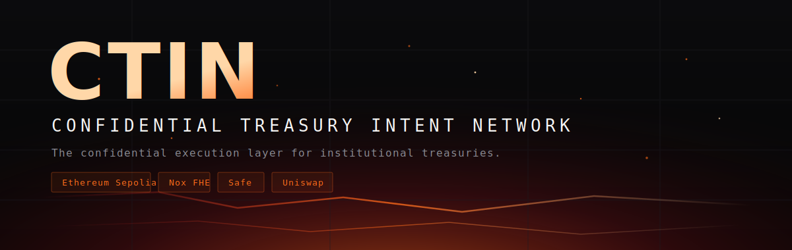
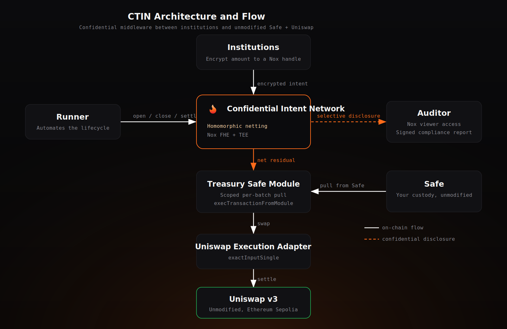
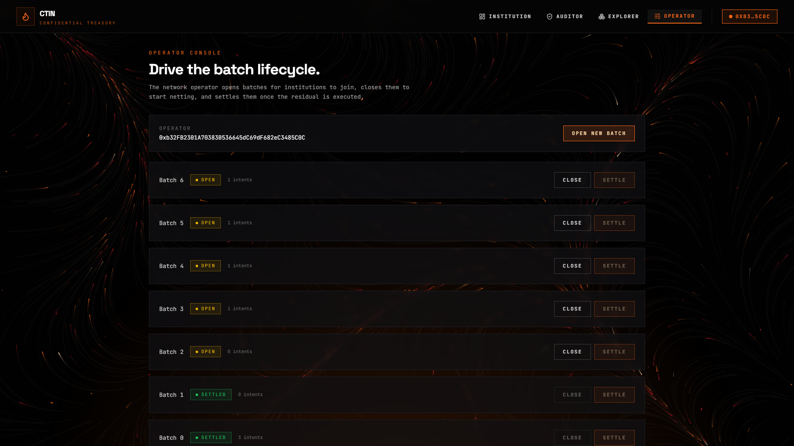

<p align="center">
  
</p>

<p align="center">
  <b>The confidential execution layer for institutional treasuries.</b>
</p>

<p align="center">
  Ethereum Sepolia &nbsp;·&nbsp; Nox FHE &nbsp;·&nbsp; Safe &nbsp;·&nbsp; Uniswap &nbsp;·&nbsp; Next.js &nbsp;·&nbsp; Vercel
</p>

---

CTIN lets many institutions submit encrypted treasury intents, nets them privately with Nox,
executes the single net residual on unmodified Uniswap with funds pulled straight from each
Safe, and returns confidential receipts. Strategy stays hidden, custody stays in the Safe, and
authorized auditors keep verifiable, revocable visibility on demand. Built for the iExec WTF
Hackathon Summer Edition.

## Demo

A full walkthrough is in the demo video, produced with the Remotion project in `videos/ctin-film`.
It follows the live six-step flow on Ethereum Sepolia: connect wallet, the operator opens a batch,
an institution submits an encrypted intent and decrypts its own receipt, the public explorer shows
only the net, then an authorized auditor decrypts the disclosed intent and exports a signed
compliance report.

<p align="center">
  <a href="https://youtu.be/hHakbuP3OfQ">
    
  </a>
</p>

<p align="center">
  <b><a href="https://youtu.be/hHakbuP3OfQ">▶ Watch the demo on YouTube</a></b> &nbsp;·&nbsp; or <a href="./assets/ctin-demo.mp4">play or download the MP4</a>
</p>

## Problem

Every DAO, crypto fund, stablecoin issuer, and tokenized asset manager has a treasury. The
moment they rebalance, buy, sell, or pay on-chain, everyone sees it.

- **Strategy leakage** — competitors read positions, runway, and counterparties directly from the chain.
- **Extractable value** — sandwich attacks extracted more than 289 million dollars in the first half of 2025 by watching trade size before execution.
- **Copy trading** — large intents are front-run and mirrored, pushing price away before an institution finishes its order.

Institutions therefore avoid moving treasury operations fully on-chain.

## Solution

CTIN is a shared confidential execution layer. Existing private tools hide one transaction.
CTIN hides the entire treasury strategy across many institutions by netting encrypted intents
before anything touches the market.

```
Institution A: Buy  400 ETH
Institution B: Sell 350 ETH          netted with Nox          Single on-chain trade
Institution C: Buy  100 ETH   ───────────────────────────▶   Buy 150 ETH
                                                             (nobody sees who or how much)
```

- **Encrypted intents** — amounts and direction are encrypted with Nox on the device before submission.
- **Homomorphic netting** — intents are summed on encrypted data so only the net residual is ever revealed.
- **Execution from the Safe** — a scoped Safe module pulls the net residual straight from the institution's Safe and routes it through unmodified Uniswap; no new vault, no fund migration.
- **Fair clearing price** — the net trade is slippage protected against a blended executed and oracle reference price.
- **Auditor selective disclosure** — an institution authorizes an auditor address that gains real Nox viewer access to its intents, revocable for future intents.
- **Signed compliance reports** — an authorized auditor decrypts disclosed intents and exports a wallet-signed report.
- **Confidential receipts** — every party decrypts only its own fill.

## Architecture

CTIN is a confidential middleware layer between institutions and the public protocols they
already use. Institutions and the operator interact with the on-chain **Confidential Intent
Network**; sensitive amounts live off-chain as Nox handles and are only ever computed on inside
a TEE.

<p align="center">
  
</p>

Text view of the confidential execution flow:

```
Institution ─ browser encrypts the amount with Nox ─▶ submitIntent ─▶ Confidential Intent Network
Operator / Runner ─▶ closeBatch ─▶ decrypt the net with Nox ─▶ executeSettlement
        └▶ Treasury Safe Module pulls the net from the Safe ─▶ Uniswap Execution Adapter ─▶ Uniswap v3 ─▶ recipient
Auditor ─ authorized by an institution ─▶ decrypt disclosed intents ─▶ signed compliance report
```

### Components

| Component | Role |
| --- | --- |
| **Confidential Intent Network** | Core contract. Opens batches, accepts encrypted intents, homomorphically nets buy and sell totals with Nox, manages auditor authorization, and drives settlement. |
| **Treasury Safe Module** | A Safe module that holds a per-batch, per-token allowance set by the Safe, and lets the network pull exactly the netted amount out of the Safe through `execTransactionFromModule`. Custody never leaves the Safe. |
| **Uniswap Execution Adapter** | Swaps the netted residual on unmodified Uniswap v3 via `exactInputSingle` and forwards the output to the recipient. |
| **Nox (FHE + TEE)** | Encrypts amounts into handles, computes the net on encrypted data inside a TEE, and enforces per-handle access control for owners and authorized auditors. |
| **Runner** | Off-chain service that automates the lifecycle: open, close after a window, decrypt the net, and settle or execute. |
| **Frontend** | Institution, operator, auditor, and explorer consoles with confidential submit, decrypt, and compliance export. |

### Lifecycle

1. **Submit** — the browser encrypts the amount with Nox and calls `submitIntent` with an opaque handle and proof. Only the owner, the disclosure authority, and any authorized auditor can decrypt it.
2. **Net** — the operator or runner calls `closeBatch`, then decrypts the encrypted buy and sell totals off-chain to obtain the net amount and direction.
3. **Execute** — `executeSettlement` pulls the net from the Safe through the module and swaps it on Uniswap; the batch becomes `Settled` and emits `BatchExecuted`.
4. **Disclose** — an institution calls `authorizeAuditor`; that auditor then decrypts exactly the intents disclosed to it and exports a signed compliance report.

## The application

Four consoles, all on the magma-themed front end, running against the live Sepolia deployment.

**Institution console** — compose an encrypted intent (direction, asset, amount), submit it into the
open batch, and decrypt your own confidential receipts. The amount is encrypted on the device before
it reaches the chain.

<p align="center">
  
</p>

**Operator console** — drive the batch lifecycle: open a batch, close it to start netting, and settle
or execute it.

<p align="center">
  
</p>

**Batch explorer** — the public view. Everyone sees one netted footprint per batch and the settlement
status, never who traded or how much.

<p align="center">
  
</p>

**Auditor console** — an institution authorizes an auditor address; that auditor then decrypts exactly
the intents disclosed to it and exports a wallet-signed compliance report. No one else can read them.

<p align="center">
  
</p>

## Contracts API

### ConfidentialIntentNetwork

Batch status enum: `Open, Netting, Executing, Settled, Reverted`.

| Function | Access | Description |
| --- | --- | --- |
| `openBatch() → uint256 batchId` | operator | Opens a batch. Emits `BatchOpened`. |
| `submitIntent(uint256 batchId, externalEuint256 handle, bytes proof, bool isBuy)` | any | Validates the encrypted input, adds it to the encrypted buy or sell total, grants viewer access to the caller's authorized auditor, and emits `IntentSubmitted(batchId, institution, isBuy, handle)`. |
| `closeBatch(uint256 batchId)` | operator | Open to Netting. Emits `BatchClosed`. |
| `settleBatch(uint256 batchId, bytes32 reference)` | operator | Netting to Settled, recording a settlement reference. Emits `BatchSettled`. |
| `executeSettlement(uint256 batchId, address safe, address assetIn, address assetOut, uint256 netAmountIn, uint256 minimumAmountOut, address recipient, bytes32 reference) → uint256 amountOut` | operator | Pulls the net from the Safe through the module, swaps it on Uniswap via the adapter, marks the batch Settled, and emits `BatchSettled` and `BatchExecuted`. |
| `authorizeAuditor(address auditor)` | institution | Authorizes one auditor to decrypt the caller's future intents. Emits `AuditorAuthorized`. |
| `revokeAuditor()` | institution | Clears the caller's auditor for future intents. Emits `AuditorRevoked`. |
| `auditorOf(address institution) → address` | view | Current auditor for an institution. |
| `batchStatusOf(uint256 batchId) → uint8` | view | Batch status. |
| `encryptedBuyTotalOf(uint256 batchId) → euint256` | view | Encrypted buy total handle. |
| `encryptedSellTotalOf(uint256 batchId) → euint256` | view | Encrypted sell total handle. |
| `intentCountOf(uint256 batchId) → uint256` | view | Number of intents in a batch. |
| `setExecutionAdapter(address adapter)` | operator | Sets the Uniswap execution adapter. |
| `setSettlementModule(address module)` | operator | Sets the Treasury Safe module. |

### TreasurySafeModule

| Function | Access | Description |
| --- | --- | --- |
| `setBatchAllowance(uint256 batchId, address token, uint256 amount)` | the Safe | The Safe scopes how much the network may pull for a batch. |
| `allowanceOf(address safe, uint256 batchId, address token) → uint256` | view | Remaining scoped allowance. |
| `pullForSettlement(address safe, uint256 batchId, address token, uint256 amount, address recipient) → bool` | settlement coordinator | Pulls up to the scoped allowance out of the Safe via `execTransactionFromModule`. |

### UniswapExecutionAdapter

| Function | Access | Description |
| --- | --- | --- |
| `executeNetResidual(address assetIn, address assetOut, uint256 residualAmountIn, uint256 minimumAmountOut, address recipient) → uint256 amountOut` | network contract | Swaps the residual on Uniswap v3 `exactInputSingle` and sends the output to the recipient. |

## Repository layout

```
CTIN
├── frontend     Next.js application (magma fissure theme, deployed on Vercel)
├── contracts    Hardhat workspace with the Nox confidential contracts
├── runner       Off-chain settlement automation service
└── assets       Brand assets
```

### Frontend structure

```
frontend/app                  Next.js routes, root layout, and providers
frontend/source/design        Theme tokens
frontend/source/background    Magma fissure particle field
frontend/source/wallet        Wallet connection configuration
frontend/source/layout        Navigation and page shell
frontend/source/notifications Toast provider and hook
frontend/source/confidential  Nox handle client, decrypt hook, asset decimals
frontend/source/landing       Landing page sections
frontend/source/institution   Institution console
frontend/source/auditor       Auditor console and compliance report export
frontend/source/operator      Operator console
frontend/source/explorer      Batch explorer
frontend/source/shared        Shared components, transaction runner, error handling
```

### Contracts structure

```
contracts/contracts/core          Intent network, disclosure registry, safe module
contracts/contracts/adapters      Uniswap execution adapter
contracts/contracts/interfaces    Shared interfaces
contracts/contracts/test-support  Mock safe, token, and swap router for tests
contracts/test                    Contract tests
contracts/scripts                 Deployment and verification scripts
contracts/deployments             Recorded deployment addresses
```

## Runner

The runner automates the batch lifecycle against the deployed contracts.

```
cd runner
npm install
cp .env.example .env
npm run check     # verify the fair-price model
npm run once      # run a single pass
npm start         # run continuously
```

The runner reads addresses from `contracts/deployments/sepolia.json`, decrypts the net with the
Nox handle client, and settles or executes each batch. Setting `SETTLEMENT_SAFE`,
`SETTLEMENT_ASSET_IN`, and `SETTLEMENT_ASSET_OUT` switches it from recording to on-chain
execution through the Safe.

## Tech stack

| Layer | Technology |
| --- | --- |
| Framework | Next.js 15, React 19, TypeScript |
| Styling | Tailwind CSS, Space Grotesk, JetBrains Mono |
| Motion | Canvas magma fissure particle field |
| Wallet | wagmi, viem, RainbowKit |
| Notifications | Toast provider with friendly error mapping and an error boundary |
| Confidential compute | Nox confidential smart contracts (FHE + TEE) |
| Contracts | Solidity 0.8.35, Hardhat |
| Runner | Node, ethers, Nox handle SDK |
| Integrated protocols | Safe, Uniswap v3 (both unmodified) |
| Network | Ethereum Sepolia |
| Deployment | Vercel |

## Installation and setup

### Prerequisites

- Node.js 18 or later
- A WalletConnect project id
- A funded Sepolia account for contract deployment

### Frontend

```
cd frontend
npm install
cp .env.local.example .env.local
npm run dev
```

Open http://localhost:3000. Build for production with `npm run build`.

Frontend environment variables:

```
NEXT_PUBLIC_WALLET_CONNECT_PROJECT_ID
NEXT_PUBLIC_SEPOLIA_RPC_URL
NEXT_PUBLIC_INTENT_NETWORK_CONTRACT_ADDRESS
NEXT_PUBLIC_DISCLOSURE_REGISTRY_CONTRACT_ADDRESS
NEXT_PUBLIC_SAFE_MODULE_CONTRACT_ADDRESS
NEXT_PUBLIC_EXECUTION_ADAPTER_CONTRACT_ADDRESS
NEXT_PUBLIC_DEPLOYMENT_START_BLOCK
```

### Contracts

```
cd contracts
npm install
cp .env.example .env
npm run compile
npm run test
npm run deploy:sepolia
```

Contract environment variables:

```
SEPOLIA_RPC_URL
DEPLOYER_PRIVATE_KEY
UNISWAP_SWAP_ROUTER_ADDRESS   optional, defaults to the Uniswap v3 Sepolia router
```

### Deploy the frontend to Vercel

- Set the Vercel project root directory to `frontend`.
- Framework preset is detected as Next.js.
- Add the frontend environment variables in the Vercel project settings.

## What makes CTIN different

Confidential netting into a single trade is no longer rare on its own. CTIN's edge is the
institutional stack layered on top of it, which nothing else combines:

- **Runs on your existing Safe.** A Safe module pulls the netted trade and executes it, so funds never move into a new vault and the multisig is untouched. Other confidential trading projects require depositing into their own custody contract.
- **Real auditor selective disclosure.** An authorized auditor gains genuine Nox viewer access to an institution's intents, verifiable on-chain, and revocable for future intents. No other entrant offers compliance disclosure.
- **Signed compliance reports.** An auditor decrypts only what was shared and exports a wallet-signed report for regulators and limited partners.
- **Automated, off-chain runner.** Opens, closes, decrypts the net, and settles or executes without manual steps.
- **Fair clearing price.** The net trade is slippage protected against a blended executed and oracle reference price.

| Capability | CTIN | Own-vault swap tools | Governance tools |
| --- | :--: | :--: | :--: |
| Confidential netting to a single trade | Yes | Yes | No |
| Executes from your existing Safe | Yes | No | No |
| Automated Safe-module execution | Yes | No | No |
| Real auditor decryption access | Yes | No | No |
| Signed compliance report | Yes | No | No |

The positioning: the only confidential DeFi layer that executes netted treasury trades from your
existing Safe, with built-in, verifiable auditor compliance.

## Networks

All contracts and the application run on Ethereum Sepolia. Live addresses are recorded in
`contracts/deployments/sepolia.json`.

## Deployed contracts (Ethereum Sepolia)

| Contract | Address |
| --- | --- |
| ConfidentialIntentNetwork | [0xd304B5eA5f5817CdF87a7EA3FD699295A61a7a29](https://sepolia.etherscan.io/address/0xd304B5eA5f5817CdF87a7EA3FD699295A61a7a29) |
| DisclosureRegistry | [0x1D88027319d5A71E8d94AdDf6957A9A5D3F78aE9](https://sepolia.etherscan.io/address/0x1D88027319d5A71E8d94AdDf6957A9A5D3F78aE9) |
| TreasurySafeModule | [0x656bA351cA00B782df72A622FB9F7c103E9769bf](https://sepolia.etherscan.io/address/0x656bA351cA00B782df72A622FB9F7c103E9769bf) |
| UniswapExecutionAdapter | [0x0CD82C57190fCC4314911b25DDBC4F727E5Acc32](https://sepolia.etherscan.io/address/0x0CD82C57190fCC4314911b25DDBC4F727E5Acc32) |

Open a new batch so institutions can submit intents:

```
cd contracts
npm run open-batch:sepolia
```

Or let the runner manage the lifecycle automatically with `cd runner && npm start`.
